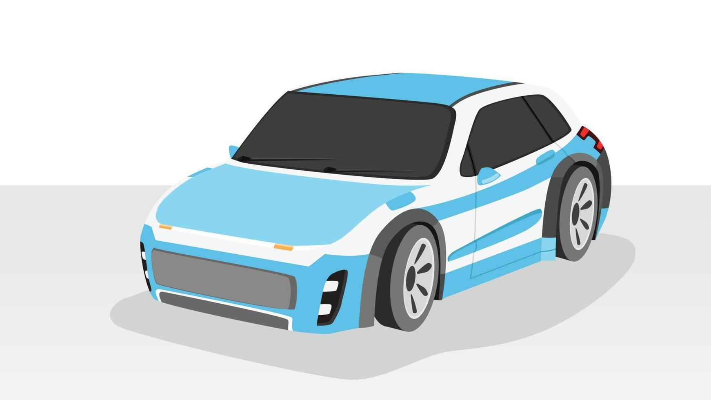
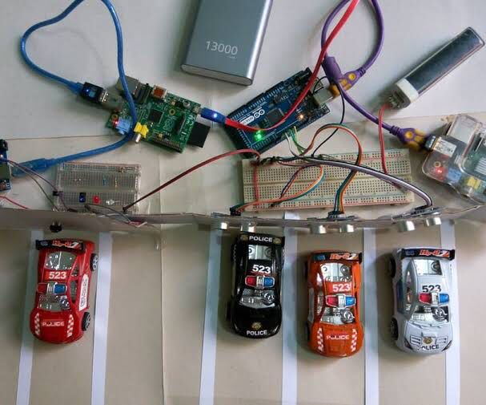
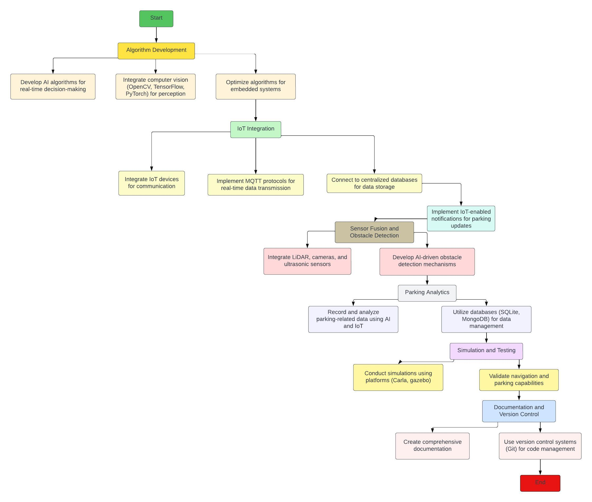
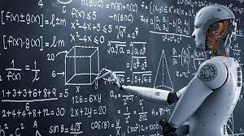

# IntelliPark &sdot; Autonomous Vehicle Parking System

## 1. Introduction

In the era of technological advancements, the automotive industry has witnessed a transformative shift towards autonomous driving solutions. Our project endeavors to contribute to this evolution by developing a self-driving car equipped with an intelligent automatic parking system. This innovative system aims to autonomously navigate the vehicle into parking spaces, utilizing real-time data from sensors, cameras, and advanced computing.

Automatic parking, a hallmark of autonomous vehicle maneuvering, encompasses the seamless transition of a car from a traffic lane to a parking spot, embracing various configurations such as parallel, perpendicular, or angled parking. The proposed system prioritizes not only efficient parking but also ensures adaptability to dynamic environments by employing sensor-based obstacle detection.

In the event of obstacles obstructing the vehicle's path, our self-driving car will dynamically alter its course, avoiding collisions and ensuring safe navigation within the parking area. To enhance the overall functionality, crucial information such as the departure and arrival of the vehicle will be systematically recorded in a database, offering insights into usage patterns and optimizing operational efficiency.

The heart of our project lies in the integration of cutting-edge technologies, including computer vision, sensors, and mechanical components. This amalgamation enables our self-driving car to execute complex parking maneuvers with precision and speed. The implementation of turntables further streamlines the departure process, eliminating the need for drivers to engage in manual reverse maneuvers.

As we delve into the details of this project, our aim is not only to create a miniature self-driving car with automatic parking capabilities but also to contribute to the broader discourse on the integration of autonomous systems in large, multi-story or multi-level parking facilities. Through a detailed analysis of relevant data, we strive to underscore the efficacy of our automated parking system, showcasing its potential to reduce manual efforts, save time, and enhance overall operational efficiency in parking management.

## 2. Literature Review 

In recent years, the convergence of Artificial Intelligence (AI) and the Internet of Things (IoT) has propelled groundbreaking advancements in various domains, with the automotive industry standing at the forefront of this transformative wave. This literature review aims to contextualize our project, which leverages the synergies between AI and IoT in the development of a self-driving car equipped with an intelligent automatic parking system.

1. **AI in Autonomous Vehicle Technology:**
    The integration of AI in autonomous vehicle technology has been a key focus of research. Pioneering studies by *Akshitha Karnati, Devanshi Mehta, Manu K S, 2023* delve into the application of AI algorithms for real-time decision-making, enabling vehicles to navigate dynamically changing environments. Our project builds upon these foundations, employing AI to process sensor data, interpret visual cues, and execute intricate parking maneuvers.

2. **IoT-enabled Parking Solutions:**
    The marriage of IoT with parking solutions has opened avenues for enhanced connectivity and data-driven insights. Works by *Hardik Tanti, Pratik Kasodariya, Shikha Patel, Dhaval H. Rangrej, 2020 *explore the utilization of IoT devices to collect and transmit parking-related data in real-time. Our project incorporates IoT elements to facilitate seamless communication between the self-driving car, parking infrastructure, and a centralized database, allowing for efficient parking resource management.

3. **AI-driven Object Detection for Parking Safety:**
    Research efforts by *Ashish Kumar, 2020* underscore the importance of AI-driven object detection in ensuring the safety of autonomous vehicles during parking maneuvers. By integrating AI algorithms, our self-driving car system can dynamically adapt its course in response to obstacles, contributing to a safer and more reliable automated parking experience.

4. **IoT-enabled Data Management for Parking Analytics:**
    The integration of IoT for data management in parking analytics has been explored by *Nasir Shirvanian, Maryam Shams, Amir Masoud Rehmani, 2022*. Our project extends this concept, utilizing IoT devices to record and transmit crucial information about the car's departure and arrival to a centralized database. This approach facilitates comprehensive parking analytics and user behavior insights.

5. **Real-time Feedback through IoT:**
    Real-time feedback mechanisms, facilitated by IoT, have been investigated to enhance user experience in parking systems. *Kyoung-Don Kang, 2022* highlight the role of IoT in providing timely notifications to users. Our project aligns with this perspective, incorporating IoT to display real-time messages when parking slots are occupied, contributing to an interactive and user-friendly experience.

By synthesizing insights from these studies, our project positions itself at the intersection of AI and IoT, presenting a holistic approach to self-driving car technology with an automated parking system. The infusion of AI algorithms and IoT connectivity not only showcases the state-of-the-art in autonomous vehicle research but also underscores the potential for these technologies to redefine the landscape of smart and efficient parking solutions.

## 3. Problem Statement

In the context of advancing technologies, our project aims to address the following challenges and objectives in the development of a self-driving car system integrated with Artificial Intelligence (AI) and the Internet of Things (IoT), specifically designed for an intelligent automatic parking system.

1. **AI-Driven Autonomous Navigation:**
    Develop AI algorithms capable of real-time decision-making and autonomous navigation, allowing the self-driving car to interpret and respond dynamically to its environment. The challenge is to create a robust system that seamlessly integrates AI for precise and adaptive maneuvering within parking areas.

2. **IoT-enabled Parking Resource Management:**
    Integrate IoT devices to establish seamless communication between the self-driving car, parking infrastructure, and a centralized database. The goal is to enable efficient data transmission for recording departure and arrival information, contributing to comprehensive parking resource management and analytics.

3. **AI-based Object Detection and Safety Measures:**
    Implement AI-driven object detection mechanisms to enhance the safety of parking maneuvers. The challenge lies in developing algorithms that can accurately identify obstacles in real-time, enabling the self-driving car to dynamically adjust its course and avoid collisions during the parking process.

4. **IoT-facilitated Real-time Feedback System:**
    Leverage IoT connectivity to establish a real-time feedback system, notifying users when parking slots are occupied. This entails the development of an interactive and user-friendly interface that enhances the overall experience by providing instant information about parking availability.

5. **Integration of AI and IoT for Parking Analytics:**
    Combine the power of AI and IoT to create a cohesive system for recording and analyzing parking-related data. The challenge is to develop algorithms that extract meaningful insights from the data transmitted by IoT devices, offering valuable information about user behavior and optimizing parking resource allocation.

By addressing these challenges, our project aspires to contribute to the forefront of AI and IoT applications in autonomous vehicle technology, presenting a comprehensive solution for a self-driving car system with an intelligent automatic parking system. The successful implementation of this project not only advances the current state-of-the-art but also demonstrates the potential for these technologies to revolutionize the landscape of smart and efficient parking solutions.

## 4. Scope and Significance

1. **Autonomous Parking Technology:** 
    This project aims to pioneer state-of-the-art autonomous parking technology. It involves the development and implementation of advanced AI algorithms that enable the self-driving car to make real-time decisions and autonomously park in predefined spaces.

2. **AI and IoT Integration:**
    A key aspect of the project is the seamless integration of AI and IoT technologies. We endeavor to harness the power of AI for intelligent decision-making during parking maneuvers and leverage IoT for establishing efficient communication channels between the self-driving car, parking infrastructure, and a centralized database.

3. **Real-time Feedback System:**
    The project focuses on creating a responsive real-time feedback system. Through IoT-enabled notifications, users will receive timely updates about parking slot availability, significantly enhancing the overall user experience and aiding in informed decision-making.

4. **Comprehensive Parking Analytics:**
    Our project extends its reach into the realm of parking analytics. By integrating AI and IoT, the system will record and analyze data pertaining to parking usage patterns. This not only contributes valuable insights but also serves as a foundation for optimizing resource allocation in parking areas.

5. **Obstacle Detection and Safety Measures:**
    A critical component of the project is the implementation of AI-driven obstacle detection mechanisms. This feature enhances the safety of parking maneuvers as the self-driving car dynamically adjusts its course based on real-time data, ensuring collision-free parking.

6. **Enhanced User Experience:**
    The significance of this project lies in its potential to redefine user experience in parking. The combination of real-time feedback, autonomous parking, and adaptive navigation promises a seamless and user-friendly parking system.

7. **Efficient Resource Management:**
    By utilizing AI and IoT for parking analytics, our project holds significance in improving resource management in parking areas. The insights derived from data analysis inform decisions on optimal resource allocation, contributing to heightened operational efficiency.

8. **Safety in Autonomous Parking:**
    The project addresses safety concerns associated with autonomous parking, marking a significant advancement in the field. The implementation of obstacle detection and safety measures demonstrates the feasibility of AI-driven systems in ensuring secure parking maneuvers.

9. **Technological Advancements in Transportation:**
    This project contributes to the broader landscape of technological advancements in transportation. The fusion of AI and IoT technologies not only showcases innovation but also signals a paradigm shift in traditional modes of transportation.

In summary, the scope and significance of this project extend beyond the development of a functional self-driving car with autonomous parking capabilities. It encompasses broader implications for user experience, resource management, safety, and technological innovation within the realm of transportation.

## 5. Objectives 

1. **Development of AI Algorithms:**
    Design and implement advanced AI algorithms capable of real-time decision-making, enabling the self-driving car to autonomously navigate within a parking area, interpret its surroundings, and execute precise parking maneuvers.

2. **Integration of IoT Devices:**
    Integrate IoT devices to establish seamless communication between the self-driving car, parking infrastructure, and a centralized database. This involves developing robust connectivity protocols for efficient data transmission related to departure, arrival, and parking slot availability.

3. **Real-time Feedback Mechanism:**
    Implement a real-time feedback mechanism using IoT to notify users about parking slot availability. Develop an interactive and user-friendly interface to enhance user experience and facilitate informed decision-making.

4. **Obstacle Detection and Avoidance:**
    Incorporate AI-driven obstacle detection mechanisms to enhance the safety of parking maneuvers. Develop algorithms that enable the self-driving car to dynamically adjust its course in response to real-time data, ensuring collision-free parking.

5. **Parking Analytics and Data Recording:**
    Develop a comprehensive system for recording and analyzing parking-related data using AI and IoT. This includes capturing usage patterns, optimizing resource allocation, and deriving meaningful insights for effective parking management.

6. **Efficient Autonomous Parking:**
    Optimize the autonomous parking process to ensure efficiency and precision. This involves fine-tuning AI algorithms for smooth navigation, accurate parking positioning, and swift execution of parking maneuvers.

7. **User Interface Development:**
    Develop a user-friendly interface that allows users to interact with the autonomous parking system. This includes providing real-time information, such as parking availability, departure, and arrival data, to enhance overall user satisfaction.

8. **Testing and Validation:**
    Conduct rigorous testing to validate the functionality, reliability, and safety of the self-driving car system with autonomous parking. Evaluate its performance in various scenarios, including different parking configurations and obstacle scenarios.

9. **Documentation and Knowledge Transfer:**
    Create comprehensive documentation detailing the system architecture, algorithms, and implementation details. Facilitate knowledge transfer by providing clear documentation for future development, maintenance, and potential upgrades.

By achieving these objectives, the project aims to deliver a fully functional and innovative self-driving car system with an intelligent autonomous parking feature, showcasing the seamless integration of AI and IoT technologies in the realm of transportation and parking solutions.

## 6. Proposed System 

The proposed system encompasses a cutting-edge integration of Artificial Intelligence (AI) and the Internet of Things (IoT) to create an intelligent self-driving car with an autonomous parking feature. The envisioned system aims to redefine the landscape of parking solutions by combining sophisticated algorithms, real-time data communication, and user-friendly interfaces. The key components of the proposed system include:

1. **Innovative AI Algorithms for Autonomous Navigation:**
    The proposed system introduces groundbreaking AI algorithms engineered for real-time decision-making. These algorithms empower the self-driving car to autonomously navigate parking areas, offering a level of precision and adaptability that sets it apart from traditional parking solutions.

2. **Seamless IoT Connectivity for Dynamic Communication:**
    By integrating IoT devices, the proposed system establishes seamless communication channels between the self-driving car, parking infrastructure, and a centralized database. This dynamic connectivity facilitates real-time data transmission, ensuring instant updates about parking slot availability and user-friendly interaction.

3. **Interactive User Interface with Real-time Feedback:**
    The user interface is meticulously designed to provide an interactive and user-friendly experience. Through IoT-enabled notifications, users receive real-time feedback on parking slot availability, enhancing their decision-making process and overall satisfaction with the parking system.

4. **Cutting-edge AI-driven Obstacle Detection and Avoidance:**
    At the heart of safety measures, the proposed system incorporates state-of-the-art AI-driven obstacle detection mechanisms. These mechanisms dynamically adjust the car's course in real-time, mitigating collision risks and ensuring a secure and reliable autonomous parking experience.

5. **Holistic Parking Analytics and Data Insights:**
    The proposed system goes beyond mere data recording, offering a comprehensive framework for parking analytics. Leveraging both AI and IoT, it captures intricate usage patterns, optimizes resource allocation, and extracts meaningful insights for informed parking management decisions.

6. **Streamlined Autonomous Parking Process:**
    The autonomous parking process is streamlined through meticulous optimization of AI algorithms. This optimization guarantees smooth navigation, precise parking positioning, and efficient execution of parking maneuvers, culminating in a seamless and efficient user experience.

7. **Rigorous Testing and Validation Protocols:**
    To guarantee functionality, reliability, and safety, the proposed system undergoes rigorous testing. Various scenarios, including different parking configurations and obstacle scenarios, are meticulously examined, affirming its robust performance in real-world conditions.

8. **Comprehensive Documentation for Sustainable Development:**
    The proposed system comes with detailed documentation outlining the system architecture, algorithms, and implementation specifics. This comprehensive documentation serves as a valuable resource for ongoing development, maintenance, and potential future upgrades, ensuring sustained success.

The integration of AI and IoT in the proposed system positions it at the forefront of autonomous parking solutions, promising a revolution in user experience, resource management, and safety within parking environments. This system aims to showcase the immense potential of cutting-edge technologies in redefining the future of transportation and parking solutions.

## 7. Flow Diagram

## 8. Tools and Technologies 

**Tools**

1. **Programming Languages:**

    •	Utilize Python as the primary programming language for its extensive libraries and frameworks in both AI and IoT domains.

    •	Incorporate languages such as C++ for efficient implementation of low-level functionalities in the embedded systems of the self-driving car.

2. **AI Frameworks:**

    •	Leverage TensorFlow and PyTorch for developing and implementing advanced AI algorithms, ensuring flexibility and compatibility with a wide range of neural network architectures.
    •	Explore OpenCV for computer vision tasks, facilitating real-time image processing for obstacle detection and navigation.

3. **IoT Platforms:**

    •	Implement IoT communication through platforms like MQTT (Message Queuing Telemetry Transport) for its lightweight and efficient publish-subscribe model, ensuring timely data transmission between the self-driving car and the parking infrastructure.

4. **Simulation Environments:**

    •	Utilize simulation environments like Carla or gazebo to emulate real-world scenarios, enabling robust testing and validation of the self-driving car's navigation and parking capabilities.

5. **Hardware Components:**

    •	Employ Raspberry Pi or similar embedded systems as the onboard computing unit for the self-driving car, providing computational power for AI algorithms and real-time decision-making.

    •	Integrate sensors such as LiDAR, cameras, and ultrasonic sensors for environmental perception, obstacle detection, and precise navigation.

6. **Development Tools:**

    •	Utilize integrated development environments (IDEs) like Jupyter Notebooks and Visual Studio Code for streamlined code development, debugging, and collaborative coding.

7. **Database Management:**

    •	Employ databases like SQLite or MongoDB to store and manage data related to parking analytics, departure, and arrival information, facilitating efficient data retrieval and analysis.

8. **Communication Protocols:**

    •   Implement communication protocols such as Wi-Fi and Bluetooth for seamless connectivity between the self-driving car and IoT devices within the parking infrastructure.

9. **Version Control:**
    •	Utilize version control systems like Git for collaborative development, enabling efficient team collaboration, code management, and version tracking.

**Methods:**

1. **AI Algorithm Development:**

    •	Employ a combination of machine learning and deep learning techniques to develop AI algorithms for real-time decision-making, object detection, and adaptive navigation within the parking area.

2. **IoT Integration:**

    •	Implement MQTT-based communication protocols to establish efficient communication channels between the self-driving car, IoT devices, and the centralized database, ensuring real-time data transmission.

3. **Sensor Fusion:**

    •	Implement sensor fusion techniques to integrate data from LiDAR, cameras, and ultrasonic sensors, enhancing the accuracy of environmental perception and obstacle detection.

4. **Simulations and Testing:**

    •	Conduct extensive simulations using platforms like Carla or gazebo to validate the self-driving car's navigation and parking capabilities in diverse scenarios, ensuring robust performance in real-world conditions.

5. **Model Training and Optimization:**

    •	Train AI models using labeled datasets for object detection, fine-tuning them to enhance performance and adaptability to various parking scenarios. Optimize models for efficient execution on embedded systems.

6. **Embedded Systems Programming:**

    •	Program the onboard computing unit using languages like C++ for embedded systems, optimizing code for efficient memory usage and real-time processing.

7. **Database Management and Analytics:**

    •	Implement database management systems to store and retrieve parking-related data. Utilize SQL or NoSQL queries for efficient data analysis, providing valuable insights into parking usage patterns.

8. **Continuous Integration and Deployment (CI/CD):**

    •	Implement CI/CD pipelines to automate testing, code integration, and deployment processes, ensuring a streamlined development workflow and quick adaptation to changes.

By selecting appropriate tools and employing robust methods, this project aims to ensure efficient development, testing, and deployment of the self-driving car system with autonomous parking capabilities, aligning with the project's overarching goals and objectives.

## 9. Project Timeline

1. **Project Initiation (Week 1):**

    -	Objectives:

        -	Define project scope and requirements.
        -	Assemble the project team.
        -	Conduct a comprehensive literature review on AI, IoT, and autonomous parking technologies.

2. **Algorithm Development (Weeks 2-3):**

    -	Key Activities:
        -	Research and select AI frameworks (TensorFlow, PyTorch).
        -	Develop and optimize AI algorithms for real-time decision-making.
        -	Integrate computer vision libraries (OpenCV) for environmental perception.

3. **IoT Integration (Week 4):**
    -	Key Tasks:
        -	Select IoT devices for communication and data transmission.
        -	Implement MQTT protocols for real-time communication.
        -	Establish connectivity with centralized databases for data storage.

4. **User Interface and Feedback (Week 5):**
•	Achievements:
        -	Develop a user-friendly interface for real-time feedback.
        -	Implement IoT-enabled notifications for parking updates.
        -	Conduct usability testing for the interface.
5. **Sensor Fusion and Obstacle Detection (Week 6):**
•	Milestones:
        -	Integrate LiDAR, cameras, and ultrasonic sensors for sensor fusion.
        -	Develop and implement AI-driven obstacle detection mechanisms.
        -	Conduct testing and optimization of obstacle detection.
6. **Parking Analytics (Week 7):**
•	Progress Summary:
        -	Implement data recording and analytics using AI and IoT.
        -	Utilize databases (SQLite, MongoDB) for efficient data management.
        -	Derive insights for optimized resource allocation.
7. **Simulation and Testing (Week 8):**
    -	Testing Phases:
        -	Conduct simulations using platforms (Carla, gazebo).
        -	Validate navigation and parking capabilities in various scenarios.
        -	Optimize AI models based on testing results.
8. **Documentation and Version Control (Week 9):**
    -	Documentation Process:
        -	Create comprehensive documentation for the system architecture and algorithms.
        -	Utilize version control systems (Git) for code management.
        -	Prepare documentation for future development and maintenance.

9. **Conclusion and Reporting (Week 10):**
    -	Finalization Steps:
        -	Summarize project outcomes in the report.
        -	Reflect on challenges, lessons learned, and potential future enhancements.
        -	Finalize the project documentation for presentation or publication.

## 10. Conclusion 

In conclusion, the presented project encapsulates an ambitious endeavor to redefine the paradigm of parking solutions through the fusion of Artificial Intelligence (AI) and the Internet of Things (IoT). The envisioned self-driving car system, equipped with an intelligent autonomous parking feature, is poised to revolutionize user experiences, enhance safety, and contribute to the broader landscape of transportation technologies. As we reflect on the key aspects of this project, several noteworthy points emerge:

1. **Innovative Technological Integration:**
    The project seamlessly integrates advanced AI algorithms and IoT connectivity, demonstrating the potential synergy between cutting-edge technologies. The amalgamation of these components propels the system beyond conventional parking solutions, marking a significant leap towards intelligent, adaptive, and user-centric transportation.

2. **User-Centric Design and Real-Time Interaction:**
    The focus on developing a user-friendly interface and real-time feedback mechanisms underscores the project's commitment to enhancing user experiences. By leveraging IoT for instant communication, users receive timely updates on parking slot availability, empowering them to make informed decisions effortlessly.

3. **Safety-Centric Autonomous Parking:**
    The incorporation of AI-driven obstacle detection mechanisms reaffirms the project's dedication to safety. The system dynamically adjusts the car's course in response to real-time data, ensuring collision-free parking maneuvers and instilling confidence in the reliability of autonomous parking.

4. **Comprehensive Parking Analytics:**
    The project's emphasis on comprehensive parking analytics, facilitated by both AI and IoT, extends beyond the immediate goals. This data-driven approach not only optimizes resource allocation but also provides valuable insights into usage patterns, contributing to informed decision-making in parking management.

5. **Technological Prowess and Future Development:**
    The choice of robust programming languages, AI frameworks, and development tools reflects the project's commitment to technological excellence. With a foundation laid in thorough documentation and version control, the project is poised for future development, maintenance, and potential upgrades.

6. **Potential Impact on Transportation:**
    Beyond its immediate applications, the project has the potential to make a lasting impact on the transportation landscape. The integration of AI and IoT technologies in autonomous parking represents a step towards smarter, more efficient, and sustainable urban mobility.

As we conclude this exploration, the project stands as a testament to the possibilities that arise from the convergence of AI and IoT in the realm of self-driving technologies. The journey undertaken aligns with the vision of creating innovative solutions that not only address current challenges in parking management but also pave the way for transformative advancements in transportation systems. Through continuous refinement, collaboration, and a commitment to excellence, this project aims to contribute meaningfully to the evolution of intelligent, automated transportation solutions.

## Presented By
- ***Zohaib Sattar***
- *Muhammad Hanzla*
- *Tehseen Aizaz*
- *Ayesha Rasheed*
